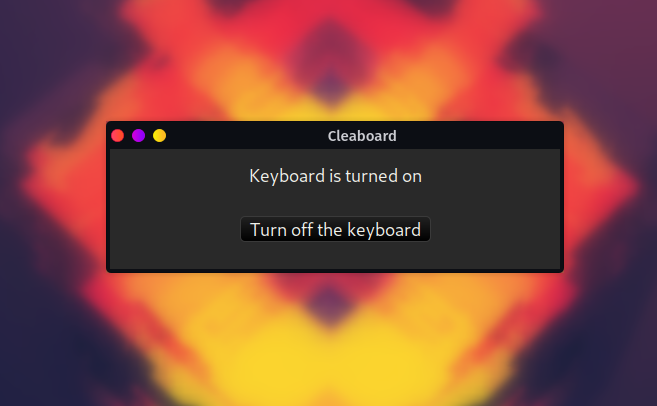
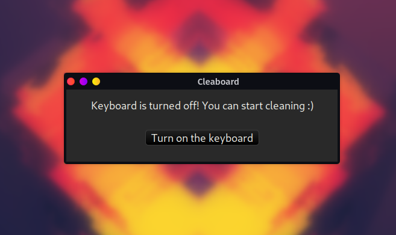

<div align="center">

  <h1><code>cleaboard</code></h1>

  <h3>
    <strong>Make keyboard cleaning easier</strong>
  </h3>

  <p>
    
    <a href="https://codecov.io/gh/devzbysiu/cleaboard">
      
    </a>
    
  </p>

  <h3>
    <a href="#about">About</a>
    <span> | </span>
    <a href="#installation">Installation</a>
    <span> | </span>
    <a href="#license">License</a>
    <span> | </span>
    <a href="#contribution">Contribution</a>
  </h3>

  <sub><h4>Built with 🦀</h4></sub>
</div>

# <p id="about">About</p>

> :warning: This is work in progress, it's already usable, but it may not work on your end yet. It's
because I'm using `xinput` to disable and enable keyboard and there is no sophisticated device ID
detection in place yet.

This is small piece of software which allows disabling the keyboard. The purpose of this is to make
keyboard cleaning easier. You just start `cleaboard`, click a button and start cleaning your keyboard
without worrying about pressing random keys. When you are done, just click the button one more time
and the keyboard will be responsive again.

It requires `xinput` to be installed, and currently it's Linux only.

<div align="center">

  

  

</div>

# <p id="installation">Installation</p>

1. First make sure you have `xinput` installed. It is used to disable and enable the keyboard.
   ```sh
   xinput --version
   ```
   If you don't have it on you system, then `cleabord` will display an error log, and it won't be
   usable.
3. Install `cleaboard` by going to [Releases](https://github.com/devzbysiu/cleaboard/releases) page and downloading the latest release.
4. Unpack it and put `cleabord` binary in your `PATH` variable.

# <p id="license">License</p>

This project is licensed under either of

- Apache License, Version 2.0, (LICENSE-APACHE or http://www.apache.org/licenses/LICENSE-2.0)
- MIT license (LICENSE-MIT or http://opensource.org/licenses/MIT)

At your option.

# <p id="contribution">Contribution</p>


Unless you explicitly state otherwise, any contribution intentionally submitted for inclusion in the work by you, as defined in the Apache-2.0 license, shall be dual licensed as above, without any additional terms or conditions.
